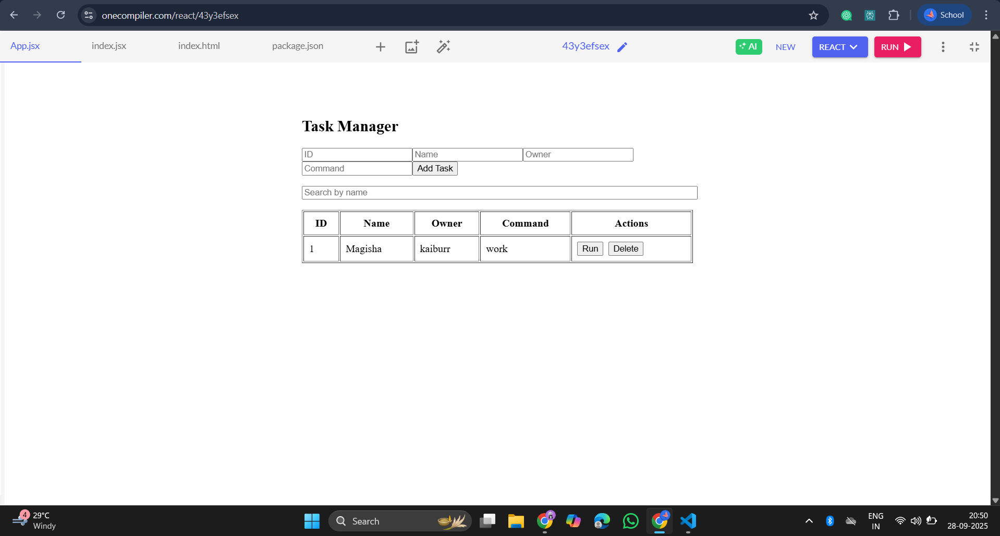
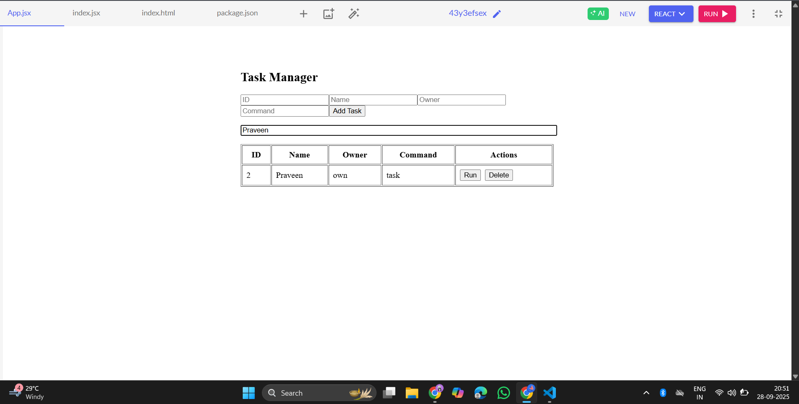
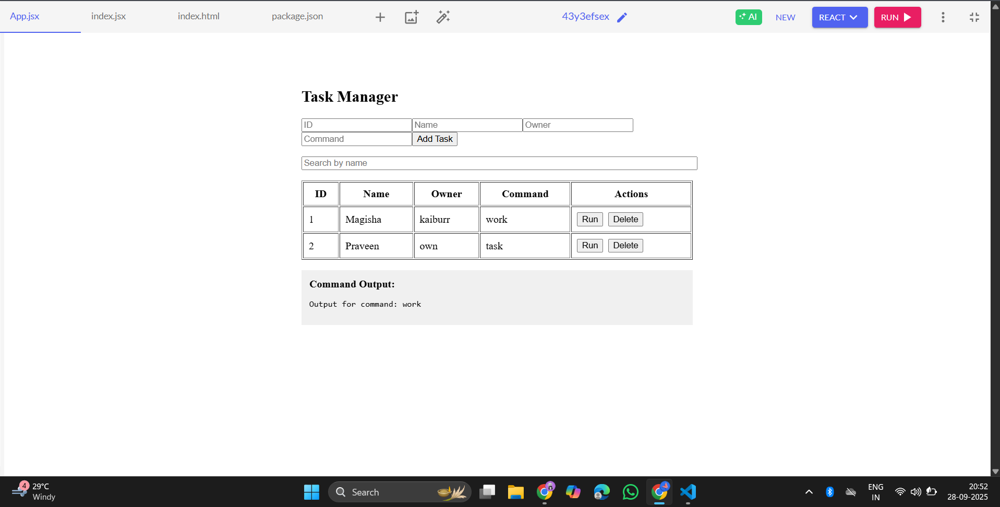

Simple Task Manager (HTML/JS):
  A minimal web-based Task Manager for adding, searching, deleting, and simulating the running of tasks. No backend or frameworks required—just open the HTML file in your browser.

Features:
Add a task (ID, Name, Owner, Command)
Search tasks by name
Delete a task
"Run" a task (simulates output)
View command output

How to Use: 

Download or copy the HTML file
Save the provided code as task-manager.html.
Open in your browser
Double-click the file or right-click and choose "Open with" your browser.
Interact with the UI
Fill in the form to add tasks.
Use the search box to filter tasks by name.
Click "Run" to simulate command output.
Click "Delete" to remove a task.

File Structure:
text
project-root/
└── task-manager.html
No Compilation or Installation Needed
This is a pure HTML/JS app. No build tools, package managers, or server required.
Works on any modern browser (Chrome, Firefox, Edge, Safari).

Example Usage:
Add a Task
Enter ID, Name, Owner, and Command, then click "Add Task".
Search
Type in the search box to filter tasks by name.
Run a Task
Click "Run" next to a task to see simulated output below the table.
Delete a Task
Click "Delete" next to a task to remove it.

Accessibility & Usability:
Keyboard navigation supported.
Responsive layout for mobile and desktop.
Clear labels and feedback for all actions.

License
This project is open for educational and demo use. No restrictions.

OUTPUT:

